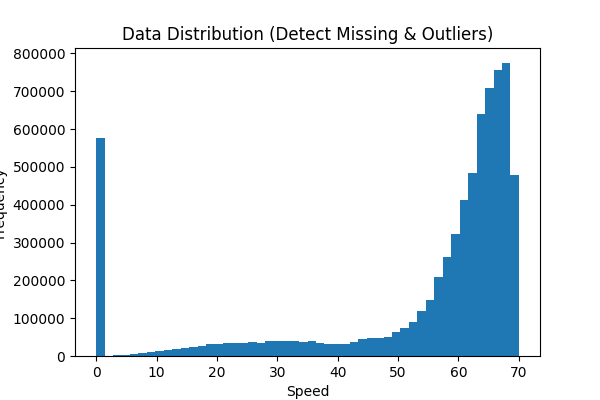
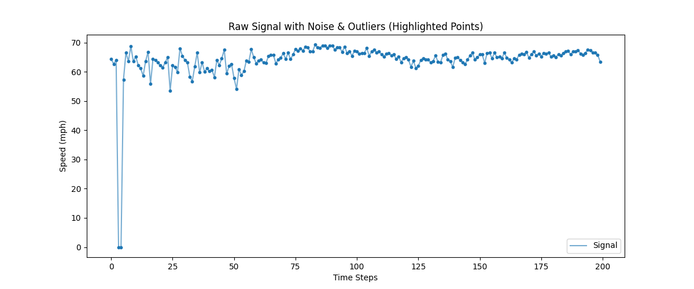
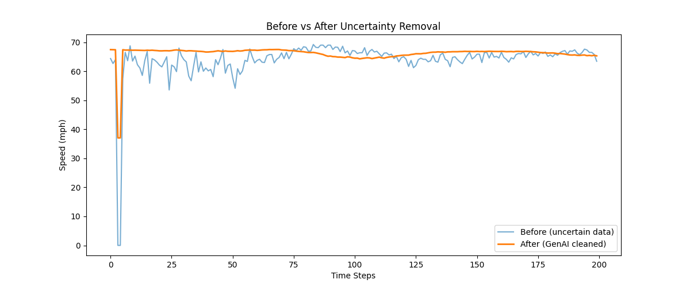

# Uncertainty Removal in Traffic Data using Autoencoder

## Overview

This project implements a deep learning approach to **clean traffic sensor data** by reducing uncertainty such as:

* Missing values (zeros)

* Noise (random fluctuations)
* Outliers (abnormal readings)



The model used is an **Autoencoder**, which learns the underlying data patterns and reconstructs a cleaner version of the dataset.

---

## Dataset

* **Dataset**: METR-LA
* **Sensors**: 207 loop detectors
* **Measurement**: Traffic speed (mph)
* **Frequency**: Every 5 minutes

---

## Project Pipeline

The workflow of the project is:

```
Raw Data → Visualization → Normalization → Autoencoder → Reconstruction → Inverse Scaling → Clean Data
```

---

## Data Preprocessing

### 1. Load Data

The dataset is loaded from an `.h5` file using `h5py`.

### 2. Data Analysis

Before training, the dataset is visualized to understand:

* Distribution of values
* Presence of missing values (zeros)
* Noise and outliers in signals

### 3. Normalization

Data is scaled to the range `[0, 1]` using MinMaxScaler to stabilize neural network training.

---

## Model Architecture

The Autoencoder consists of two parts:

### Encoder

Compresses input data:

```
207 → 128 → 64
```

### Decoder

Reconstructs the data:

```
64 → 128 → 207
```

### Bottleneck Layer

The 64-dimensional layer acts as a bottleneck, forcing the model to learn only essential patterns and ignore noise.

---

## Training

* **Loss Function**: Mean Squared Error (MSE)
* **Optimizer**: Adam
* **Epochs**: 20

The model is trained to minimize the difference between input and reconstructed output.

---

## Reconstruction

After training, the model reconstructs the input data:

```
cleaned_data = reconstructed
```

This step performs:

* Missing value correction
* Noise smoothing
* Outlier reduction

---

## Inverse Scaling

The reconstructed data is converted back to original units (mph) using inverse transformation.

---

## Visualization

The results are visualized using:

* Line plots (before vs after)
* Scatter plots (to highlight noise and outliers)

### Output Interpretation:

* Blue line → Original data
* Orange line → Cleaned data


---

## Evaluation

Mean Squared Error (MSE) is used as a supporting metric to measure reconstruction quality.

Note: Visual comparison is more meaningful for evaluating noise and outlier removal.

---

## How to Run

### 1. Install dependencies

```bash
pip install numpy torch matplotlib scikit-learn h5py
```

### 2. Place dataset

Put `metr-la.h5` in the project directory.

### 3. Run the script

```bash
python main.py
```

---

## Project Structure

```
project/
│
├── main.py
├── metr-la.h5
├── README.md
```

## Summary

This project demonstrates how an Autoencoder can be used to:

* Learn patterns in traffic data
* Remove uncertainty
* Generate a cleaner, more reliable dataset
