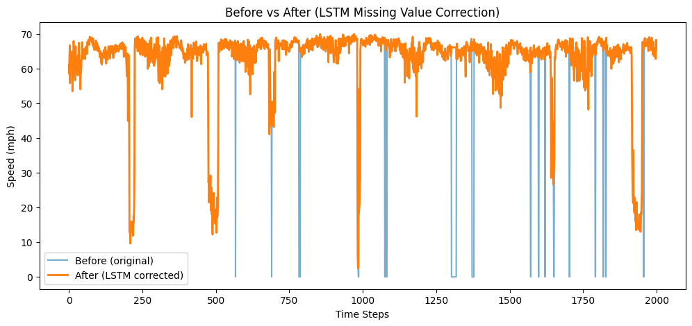

# Uncertainty Removal in Traffic Data using LSTM Autoencoder

## Overview

This project focuses on removing uncertainty from traffic sensor data using a deep learning approach based on an LSTM Autoencoder. The dataset contains speed readings collected from multiple sensors over time. Due to real-world conditions, the data includes missing values (represented as zeros) along with natural variations in traffic speed.

The objective is to correct missing values while preserving genuine traffic patterns.

---

## Dataset

- Dataset: METR-LA
- Sensors: 207
- Measurement: Speed (mph)
- Time interval: 5 minutes
- Total size: Approximately 34,000 time steps × 207 sensors

The dataset contains a significant number of zero values, which represent missing or faulty sensor readings.

---

## Problem Statement

The dataset includes uncertainty in the form of:

- Missing values (zeros)
- Natural variations in speed (not considered noise)

The goal is to:

- Replace only missing values
- Preserve real-world traffic behavior
- Avoid over-smoothing the data

---

## Methodology

1. Data Analysis

A distribution plot is used to identify the presence of missing values across the dataset. A temporal signal plot is used to observe variations in speed for a selected sensor.

2. Mask Creation

A boolean mask is created to identify missing values:

mask = (data == 0)

This ensures that only missing values are modified later.

---

3. Data Preparation (Forward Fill)

Before training, missing values are temporarily replaced using forward filling:

- Each zero is replaced with the previous valid value
- This step is only used for training the model
- It prevents the model from learning incorrect patterns

---

4. Normalization

Data is scaled to the range [0, 1] using MinMaxScaler:

- Improves training stability
- Ensures consistent value ranges

---

5. Sequence Creation

Since the dataset is temporal, sequences are created:

- Sequence length = 12
- Each sequence represents consecutive time steps

Example:

[t1, t2, t3, ..., t12]

---

6. LSTM Autoencoder Model

The model consists of:

Encoder:

- Input size: 207
- Hidden size: 128

Decoder:

- Input size: 128
- Output size: 207

The model learns temporal dependencies and reconstructs sequences.

---

7. Training

- Loss function: Mean Squared Error (MSE)
- Optimizer: Adam
- Epochs: 15

The model is trained to reconstruct the input sequences.

---

8. Reconstruction

After training:

- The model outputs reconstructed sequences
- Only the last timestep of each sequence is used for alignment

reconstructed = reconstructed[:, -1, :]

---

9. Missing Value Correction

Final step:

cleaned_data = data_aligned.copy()
cleaned_data[mask_aligned] = reconstructed_original[mask_aligned]

- Only missing values are replaced
- Original valid values remain unchanged

---

## Results

Data Distribution

Shows the presence of missing values across the dataset.

---

## Before vs After Correction

Shows comparison between original and corrected data.

---

## Observations

- Missing values are successfully corrected
- Real traffic variations are preserved
- No over-smoothing is observed
- The model respects temporal dependencies

---

## Key Insights

- Temporal data requires sequence-based models such as LSTM
- Training on raw data with missing values leads to incorrect predictions
- Forward filling improves learning without affecting final output
- Mask-based replacement ensures minimal modification

---